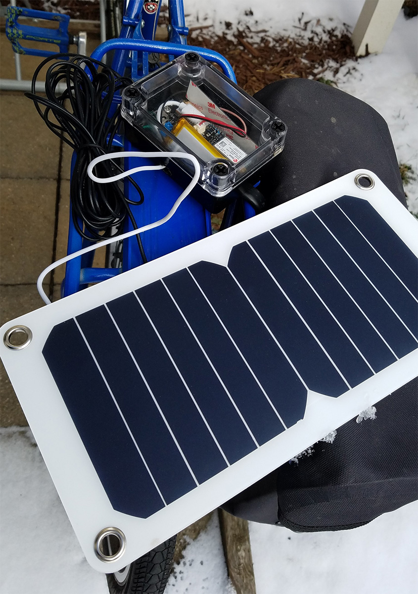

# Bike Tracker

Worried about your bike getting stolen (or, something else valuable)? Want to be able to track your thief down and get your bike / car / tophat back? Then look no further!

This clever tracking device wakes up whenever there's motion, conserving battery life. Given an average bike use case (riding ~1 hr per day), it'll run forever with a small solar cell (see parts list).



### Motion tracking outline:

- Set your device name, allowing for multiple trackers on a single account (default: `toddbike`)
- Accelerometer wakes up the electron if the device moves in the 1-2G range (the onboard blue LED will also flash when it detects motion)
- Upon wake (from motion or the long-sleep checking), it connects to the cloud and reports GPS every minute (ie `toddbike_g=40.53211,-40.23455`)
- Once the device stops sensing motion, it continues to report its location for 2 minutes (2 more reports), then goes to sleep for 8 hours
- Publishes the battery status (ie `toddbike_b=3.94v80.1%`) right before going to sleep, serving both as the "going to sleep" indicator, and allowing you to log battery state
- Solar Cell optimization: If it wakes at <20% battery (not enough to start a cell connection, which draws a lot of current), it immediately sleeps for an hour; it'll keep trying this until it's above 20% (even at 20% battery, it should be able to keep doing this for 5+ days)

### Parts list

To build your own bike tracker, you will need

- A [Particle Electron + Asset Tracker Shield](https://store.particle.io/#asset-tracker). NOTE: Make sure to get the right cellular option for your country.
- Optional: a [more powerful GPS antenna](https://www.adafruit.com/product/960) and an [adapter for that antenna](https://www.adafruit.com/product/851)
- Optional: a [solar cell](https://www.amazon.com/gp/product/B01LNKKZVY/ref=oh_aui_search_detailpage?ie=UTF8&psc=1) - any solar cell will do, though the linked to one is nice because it fits on the rear rack of a bike, is inexpensive, and conveniently outputs 5v via USB. Note that it's rated for ~6 watts - if you get a solar cell with a smaller rating, it might not provide enough power to continuously power the tracker during the cold, dark days of winter.

**Total cost:** $110 - $170, plus $3/mo for the data plan


### Setting up your tracker

First, register your Particle Electron with Particle, following their setup instructions. Then, install the [particle-cli](https://github.com/spark/particle-cli).

Then, you'll want to flash this code to your Electron. Start by putting it into DFU firmware flashing mode (yellow blinking), then run:

```
./build.sh
./flash.sh
```

### Setting up your logging server

Once you have your Particle Electron up and running, you can run the logging server on your local computer to make sure it's all logging properly. To get that set up:

1. Create a `config.json` JSON file with your Particle.com username and password
2. Install node on your computer (v6+)
3. In the project folder, run `npm install` to install dependencies
4. Start the server with `npm start`. It'll log messages to the console, and also save them to events.log. If you want to get really fancy, you can deploy your server to the cloud via AWS, Heroku, etc.


### Attributions and further reading

This project is possible thanks to awesome work from Particle and Adafruit, go buy stuff from them!

Related libraries and tools:

- Forked from https://github.com/dmiddlecamp/fancy-asset-tracker
- https://github.com/benagricola/tracker
- https://community.particle.io/t/asset-tracker-gps-real-time-google-map/20380
- https://docs.particle.io/datasheets/electron-datasheet/
- https://docs.particle.io/reference/firmware/electron
